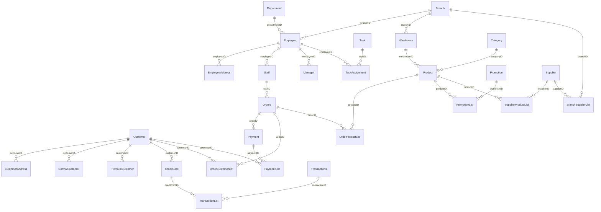

# Database model

```mermaid
erDiagram
    Customer ||--o{ CustomerAddress : "customerID"
    Customer ||--o{ NormalCustomer : "customerID"
    Customer ||--o{ PremiumCustomer : "customerID"
    Branch ||--o{ Employee : "branchID"
    Department ||--o{ Employee : "departmentID"
    Employee ||--o{ EmployeeAddress : "employeeID"
    Employee ||--o{ Staff : "employeeID"
    Employee ||--o{ Manager : "employeeID"
    Task ||--o{ TaskAssignment : "taskID"
    Employee ||--o{ TaskAssignment : "employeeID"
    Branch ||--o{ Warehouse : "branchID"
    Category ||--o{ Product : "categoryID"
    Warehouse ||--o{ Product : "warehouseID"
    Staff ||--o{ Orders : "staffID"
    Orders ||--o{ Payment : "orderID"
    Customer ||--o{ CreditCard : "customerID"
    Orders ||--o{ OrderCustomerList : "orderID"
    Customer ||--o{ OrderCustomerList : "customerID"
    Orders ||--o{ OrderProductList : "orderID"
    Product ||--o{ OrderProductList : "productID"
    Payment ||--o{ PaymentList : "paymentID"
    Customer ||--o{ PaymentList : "customerID"
    Transactions ||--o{ TransactionList : "transactionID"
    CreditCard ||--o{ TransactionList : "creditCardID"
    Promotion ||--o{ PromotionList : "promotionID"
    Product ||--o{ PromotionList : "productID"
    Supplier ||--o{ SupplierProductList : "supplierID"
    Product ||--o{ SupplierProductList : "productID"
    Branch ||--o{ BranchSupplierList : "branchID"
    Supplier ||--o{ BranchSupplierList : "supplierID"
```

Relationships show foreign-key structure; optionality and subtype constraints are not fully represented.
